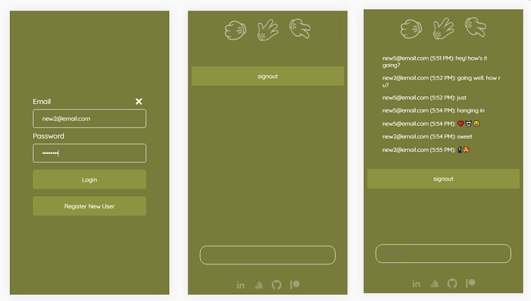
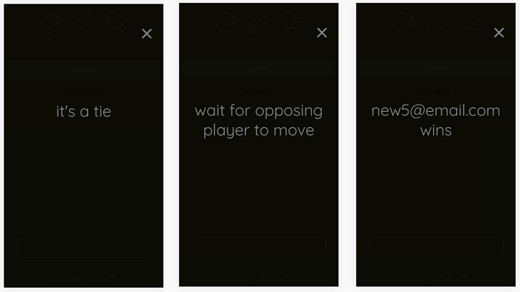

# RPS-Multiplayer
 
This was the Week 4 challenge project at the Rutgers University Full Stack Web Depelopment Bootcamp. The outcome of the project is a web app that uses Firebase for authentification, chat, and a simple game.

## **Built With**

* [JavaScript](https://www.javascript.com/) general purpose scripting language
* [jQuery](https://jquery.com) simplify AJAX handling, DOM traversal & manipulation
* [Firebase](https://firebase.google.com/) authorization and data handling

## **Objectives**

* Mobile-forward design
* Firebase authentication.
* Has a simple game.
* Has chat.

## **Screenshots**

### Main

### Modals

## **How to Use?**

* Login with an email & password combination.
* Click one of the Roshambo icons to send your turn. When the opposing player submits, the game sends the result to chat and resets the game.
* Click in the message field to send a message.

## **Free Use**

* MIT © Matthew Lorber